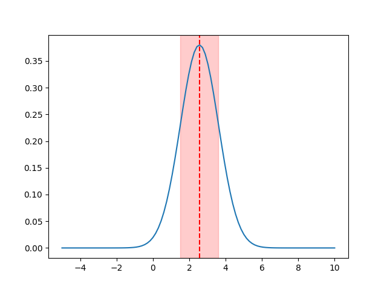
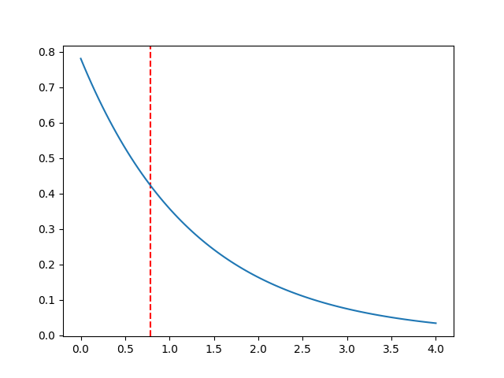
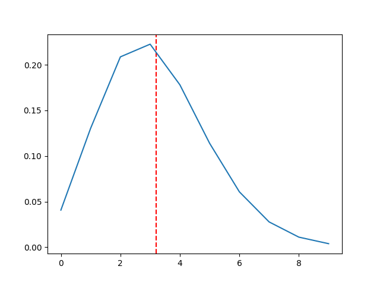
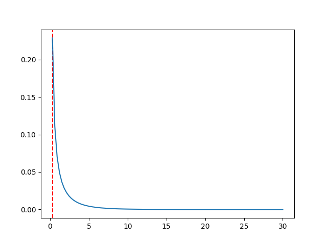
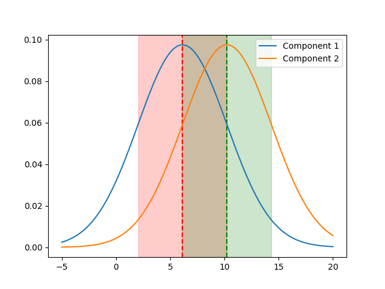

# Maximum Likelyhood Estimation

There are two general methods for parameter estimation:
- Maximum Likelihood Estimation (MLE)
- Least Squares Estimation (LSE)

LSE has been a popular method as it is tied to linear regression, sum of squares error, proportion variance and root mean quared deviation. It's certainly useful for obtaning a descriptive measure for the purpose of the summarization of datga, however, it is not a good method for parameter estimation nor for hypothesis testing.

MLE has many properties that allow it to be a more robust method for parameter estimation, such as:

- Sufficiency: Complete information about parameter is contained in the MLE estimator.
- Consistency: Parameter value that gneerated the data recovered asympotically.
- Efficiency: Lowest possible variance among all unbiased estimators.
- Parametrization invariance: MLE is invariant to reparameterization of the model.

On top of that, MLE is a prerequisite for Bayesian inference with missing data modeling random effects and model selection criteria.

## Method

Our data vector $y = (y_1,...,y_m)$ is a random sample from an unknown population. The goal is to identify the population that is most likely to have generated the data. 

Each probability distribution has a unique value of the model parameters associated with it. As the parameters change in value, the probability distribution changes in shape. The goal is to find the parameter values that maximize the probability of the observed data.

To do so, we need to define a Probability Density Function (PDF) that describes the probability of observing the data $y$ given the parameters $w$. 

$w$ is a vector of parameters $w = (w_1,...,w_n)$ defined on a multi-dimensional parameter space. If individual observations of $y$ (that is $y_i$), are statistically independent, the PDF can be expressed as the product of the individual PDFs:

$$
p(y|w) = \prod_{i=1}^{m} p(y_i|w)
$$

## Likelihood Function

The likelihood function is the PDF viewed as a function of the parameters $w$ for a fixed data vector $y$. It is defined as:

$$
L(w|y) = p(y|w)
$$

This represents the probability of observing the data $y$ given the parameters $w$.

If a model has two parameters, it's possible to visualize the likelihood function as a surface sitting above the parameter space, however, as the model increases in complexity, it becomes harder to visualize the likelihood function as it becomes a hyper-surface in a multi-dimensional parameter space.

## Optimization

Once data is collected and the likelihood function is defined, it's possible to make statistical inferences about the model population (or model). The next clear step is to find the parameter values that maximize the likelihood function. This is called the **Maximum Likelihood Estimation (MLE)**.

It is possible to maximize either the likelihood function or the log-likelihood function. The log-likelihood function is preferred as it is easier to work with and it is numerically more stable. This is denoted as $ln(w|y)$.

Doing the first differentiation of the log-likelihood function with respect to the parameters $w$ and setting it to zero, it's possible to find the maximum likelihood estimator. However, finding whether or not is it a maximum or a minimum is not trivial. To do so, the second derivative of the log-likelihood function is needed. If the second derivative is negative, then the first derivative is a maximum, otherwise, it is a minimum.

This is denoted as:

$$
\frac{\partial ln(L(w|y))}{\partial w} = 0
$$

$$
\frac{\partial^2 ln(L(w|y))}{\partial w^2} < 0
$$

Solving this analytically is not always possible, so it's necessary to use numerical methods to find the maximum likelihood estimator, such as gradient descent.

Some other considerations to take into account are the local maxima problem and the existence of multiple solutions. There are no general solutions to these problems, but there are some techniques that can be used to mitigate them, such as:

- Use of multiple starting points
- Use of different optimization algorithms
- Use of regularization

Finally, a model should be selected based on its generalizability and ability to predict new data.

## Experiment

Here are my results for the experiment:

### Normal Distribution
Mean: 2.55999
Standard Deviation: 1.0499523

### Exponential Distribution
Lambda: 0.78125

### Poisson Distribution
Lambda: 3.2

### Gamma Distribution
Shape: 0.09
Scale: 3.333

### Mixture of Normal Distributions
Mean 1: 6.1333
Standard Deviation 1: 4.094168
Mean 2: 10.2275026
Standard Deviation 2: 4.094168

